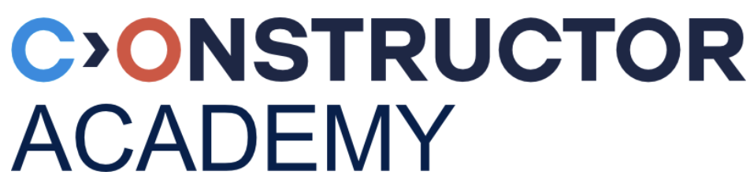
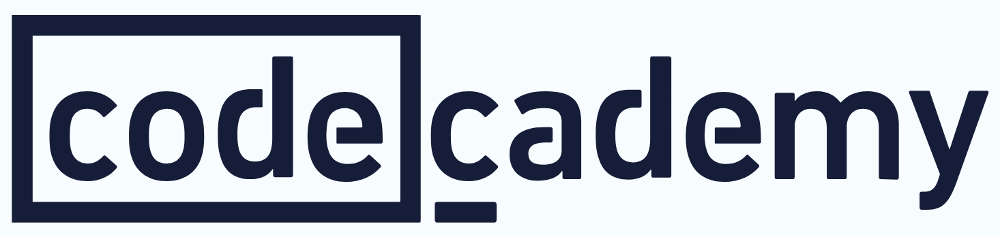
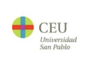

  <h1>CV Guillermo Ibanez</h1>
  

    
    
    
  

  <h1>Data & Financial Analyst</h1>
  
. Zürich ·

  <h2>📋 Summary</h2>
  

    ######Senior Risk/Counterparty Credit analyst with experience in international banking Treasury Counterparty
Credit Risk and Research/Advisory roles. Strong grasp of financial and data analysis.
 Currently looking for a more transversal role where I can apply my technical expertise in financial &amp; risk
analysis/financial products (such as insurance) and data analysis skills (python) while moving into a Risk
Finance role within a large non-banking top international company in my home city of Madrid.
 Excellent communication skills in English, including presenting risk assessments and research findings to
credit/financial risk committees and large audiences.
 Proven ability to conduct in-depth research and create comprehensive risk reports from scratch on diverse
risk/financial topics for client facing colleagues and senior management.
 Data management/analysis and visualization skills using Python programming (including Machine
Learning for data segmentation, Natural Language models, AI large models implementation). SQL
programming skills and experience using Power BI and Eikon.
 Outside-the-box thinker. Big interest to try new approaches on data analysis, presentations content and
storytelling to colleagues and other stakeholders.
 Experience planning and coordinating reports with colleagues from different locations and divisions.
 Used to working in international environments, with 9 years of experience working fully in English abroad
including writing research and making presentations in public. Native Spanish speaker. Fluent in French.
  

  <h2>🛠️ Skills</h2>
  <table>
    <tr>
      <td valign="top">
        <h3>Programming</h3>
        <ul>
          <li>Python</li>
          <li>Bash</li>
          <li>SQL</li>
          <li>HTML</li>
        </ul>
      </td>
      <td valign="top">
        <h3>Libraries</h3>
        <ul>
          <li>Matplotlib</li>
          <li>Plotly</li>
          <li>Seaborn</li>
          <li>Pandas</li>
          <li>NumPy</li>
          <li>TensorFlow</li>
          <li>Scikit-learn</li>
          <li>PyTorch</li>
          <li>SciPy</li>
        </ul>
      </td>
      <td valign="top">
        <h3>Tools & Platforms</h3>
        <ul>
          <li>GitLab</li>
          <li>JupiterLab</li>
          <li>Google Colab</li>
          <li>Visual Studio Code 2</li>
          <li>GitHub</li>
        </ul>
      </td>
    </tr>
  </table>

  <h2>💼 Work Experience</h2>
  <table>
  <tr>
    <td valign="middle"></td>
    <td valign="middle"><strong>UBS (Switzerland)</strong></td>
  </tr>
  <tr>
    <td colspan="2">Perform financial analysis and monitor the credit quality of a portfolio of investment grade financial institutions,
publishing reports to clients/other stakeholders on a regular basis. Experience interacting regularly with senior
management coordinating projects/reports across multidisciplinary and international teams.</td>
  </tr>
  <tr>
    <td colspan="2">Interact with buy-side and sell-side investment professionals and present my recommendations and credit/risk
views to colleagues and clients alike. Present my research views in internal meetings in support of UBS&#39;s asset
allocation process.</td>
  </tr>  
</table>

  
  <h3>Senior Software Engineer | <a href="https://company-website.com">Company Name</a></h3>
  
<em>January 2020 - Present</em>

  <ul>
    <li>Led the development of [specific project], resulting in [measurable outcome]</li>
    <li>Implemented [technology/feature], which improved [metric] by [percentage]</li>
    <li>Mentored junior developers and conducted code reviews</li>
    <li>Collaborated with cross-functional teams to deliver projects on schedule</li>
  </ul>
  
  <h3>Software Developer | <a href="https://previous-company.com">Previous Company</a></h3>
  
<em>June 2017 - December 2019</em>

  <ul>
    <li>Developed and maintained [product/service], serving [number] of users</li>
    <li>Optimized database queries, reducing response time by [percentage]</li>
    <li>Contributed to agile development process and participated in sprint planning</li>
  </ul>

  <h2>🎓Data Science Education</h2>
<table>
  <tr>
    <td valign="middle"></td>
    <td valign="middle"><strong>Data Science & AI Course (Constructor Academy)</strong></td>
  </tr>
</table>

 Data Science & AI Full Time in person Course 4 months Zurich, Switzerland | Graduated: May 2017

<strong>Data Analytics:</strong> Examine large and complex data sets to uncover insights, trends, and patterns that can inform decision-making. Tools used: Python · SQL · Numpy · Pandas · Jupiter Notebook · Visual Studio Code · Matplotlib · Streamlit · Bash

<strong>Machine Learning & Artificial Intelligence:</strong> Train computer algorithms to learn patterns and make predictions or decisions without explicit instructions, based on data inputs. Tools used: ChatGPT · OpenAI · LangChain · Scikit-learn · SciPy · TensorFlow · PyCaret

<strong>DevOps:</strong> Efficiently manage team tasks and collaborate using GitLab. Gain the ability to deploy your applications on the web and seamlessly connect them to each other. Tools used: GIT · GitLab · Docker · AWS

<table>
  <tr>
    <td valign="middle"></td>
    <td valign="middle"><strong>IBM edEX Data Science Python Certificates</strong></td>
  </tr>
  <tr>
    <td colspan="2">IBM Certificate for Visualizing Data with Python</td>
  </tr>
  <tr>
    <td colspan="2">IBM Certificate for Python for Data Science Project</td>
  </tr>
  <tr>
    <td colspan="2">IBM Certificate for Python Basics for Data Science</td>
  </tr>
  <tr>
    <td colspan="2">IBM Certificate for The Data Science Method</td>
  </tr>
  <tr>
    <td colspan="2">IBM Certificate for Data Science Tools</td>
  </tr>
  <tr>
    <td colspan="2">IBM Certificate for Introduction to Data Science</td>
  </tr>
</table>

<table>
  <tr>
    <td valign="middle"></td>
    <td valign="middle"><strong>Codecademy Learn Data Analysis with Pandas Course</strong></td>
  </tr>
</table>

  
  <h2>🎓Finance Education</h2> <h2>
  
<a href="https://university.edu">University Name</a> | Graduated: May 2017

  
<em>Relevant coursework: Advanced Algorithms, Machine Learning, Database Systems</em>

<table>
  <tr>
    <td valign="middle"></td>
    <td valign="middle"><strong>Master in Finance</strong></td>
    <td valign="middle"><strong>ICADE Business School (Comillas Pontifical University)</strong></td>
  </tr>
  <tr>
    <td colspan="2">Major in: Advanced Corp. Finance, Adv. Quantitative Methods</td>
  </tr>
</table>

<table>
  <tr>
    <td valign="middle"></td>
    <td valign="middle"><strong>Bachelor of business administration</strong></td>
    <td valign="middle"><strong>CEU San Pablo University</strong></td>
  </tr>
  <tr>
    <td colspan="2">Topics covered include: Finance, Accounting &amp; Economics</td>
  </tr>
</table>

  <h3>Bachelor of Science in Software Engineering</h3>
  
<a href="https://university.edu">University Name</a> | Graduated: June 2015

  
<em>Graduated with honors (GPA: 3.8/4.0)</em>

  <h2>🚀 Projects</h2>
  
  <h3><a href="https://github.com/yourusername/project-repo">Project Name</a></h3>
  
A brief description of the project, what technologies were used, and what problems it solves.

  

    
    
    
  

  
  <h3><a href="https://github.com/yourusername/another-project">Another Project</a></h3>
  
A brief description of another significant project with key features and technologies.

  

    
    
  

  <h2>📜 Certifications</h2>
  <ul>
    <li>AWS Certified Solutions Architect (2021)</li>
    <li>Google Professional Data Engineer (2020)</li>
    <li>Scrum Master Certification (2019)</li>
  </ul>

  <h2>📚 Publications & Talks</h2>
  <ul>
    <li>"<a href="https://publication-link.com">Title of Publication</a>" - Journal/Conference Name (Year)</li>
    <li>"<a href="https://talk-slides.com">Title of Talk</a>" - Conference/Meetup Name (Year)</li>
  </ul>

  <h2>🌐 Languages</h2>
  <ul>
    <li>English (C2)</li>
    <li>Spanish (C2)</li>
    <li>French (C1)</li>
    <li>German (B1)</li>
  </ul>

  
This CV is maintained in HTML within a GitHub README.md file. Last updated: May 2025.

# Working Experience
-\

-AIB (Allied Irish Banks)\
-Deutsche Bank\
-Credit Suisse\
-Spanish Ministry Of Economy And Competitiveness\
-BBVA – Corporate & Investment Banking\

### Data Science Projects
