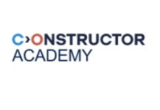

# Data & Financial Analyst

<table>
  <tr>
    <td valign="middle"></td>
    <td valign="middle"><strong>Data Science & AI Full Time in person Course 4 months</strong></td>
  </tr>
  <tr>
    <td colspan="2">Data Science & AI Course (Constructor Academy) Zurich, Switzerland</td>
  </tr>
</table>

<table>
  <tr>
    <td valign="middle"></td>
    <td valign="middle"><strong>IBM edEX Data Science Python Certificates</strong></td>
  </tr>
</table>
IBM Certificate for Visualizing Data with Python 
IBM Certificate for Python for Data Science Project 
IBM Certificate for Python Basics for Data Science 
IBM Certificate for The Data Science Method 
IBM Certificate for Data Science Tools 
IBM Certificate for Introduction to Data Science
 

## Codeacademy Data Course
Learn Data Analysis with Pandas Course (Codecademy)

## Finance formal eductation
Msc Finance\
BBA Business Administration\

### Working Experience
-UBS (Switzerland)\
-AIB (Allied Irish Banks)\
-Deutsche Bank\
-Credit Suisse\
-Spanish Ministry Of Economy And Competitiveness\
-BBVA – Corporate & Investment Banking\

### Data Science Projects
